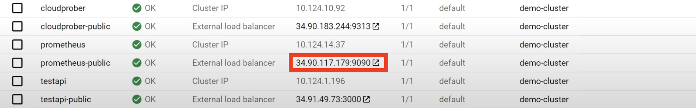
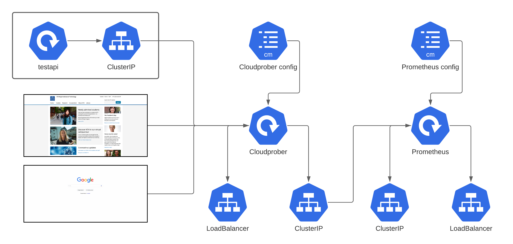

# Demonstration of Cloudproper

Proactively monitoring availability and performance of your systems is a critical thing.
As time goes by the expectation on your services being available increases.
Companies even offer guarantees of being available 99.9 % of the time.
There are great services available that help as a developer to monitor this, but it's not cheap.
This demo will show you how to set up and start using Cloudprober, an open source alternative, built by the folks at Google.


## Prerequisites

This demo assumes you have some basic knowledge about kubernetes and that you have a kubernetes cluster running, as well as one or several endpoint ready to probe. If not, feel free to use the one provided [here](./testapi) or simply use a public one.

## Steps

To start of we've prepared a kubernetes cluster and an api endpoint to probe with Cloudprober. The demo does not require a specific cloud provider, we rely as much as we can on the kubernetes cli. In the demo we use Google Cloud though. If you wan't to follow along,
please create a new kubernetes cluster on your favorite cloud platform
and why not let it probe an api or application that you've built yourself.

### 1 Connect to your cluster
First step is to connect to your kubernetes cluster, how you do this is dependent on the cloud provider you choose. For google cloud use:
```
gcloud container clusters get-credentials <cluster name>
```

### 2 Deploy Cloudprober
As one of the alternatives for downloading Cloudprober is as a Docker image, we can easiliy deploy it on our cluster.
But first we need to create an accopanying configuration file. In the configuration file we list all the probes we wan't to use, i.e the things we want to monitor.
Below is a part of the used configuration file, it creates a probe of type HTTP, with a target of `testapi:3000` and a validator
making sure it only counts as a success if the return code is between `200-299`. We specify that it should check with an interval of 1s and a timeout in 500 ms.

```
...
probe {
  name: "testapi-error"
  type: HTTP
  targets {
    host_names: "testapi:3000"
  }
  http_probe {
    relative_url: "/error"
  }
  interval_msec: 1000
  timeout_msec: 500
  validator {
    name: "success_status"
    http_validator {
        success_status_codes: "200-299"
    }
  }
}
```
The full configuration can be found [here](./cloudprober/cloudprober.cfg).

Let's deploy the configuration as a config map:
```
kubectl create configmap cloudprober-config --from-file=<path to config file>
```

Once the config file is done, we can deploy Cloudprober on our cluster. We'll do this with [this](./cloudprober/deployment.yaml) specification.
It creates a deployment with the Cloudprober docker image and passes the configuration file as an argument to it. It also creates two kubernetes services
for exposing the deployment both externally and internally. The external service here is only for us to be able to see what we've created.
*The external service can be removed when you're done with the demo.*. Let's apply the file to our cluster by running:

```
kubectl apply -f <path to deployment file>
```


### 3 Cloudprober is ready


Cloudprober should now be successfully deployed on our cluster and it should start the probes you've specified.
Check what ip got assigned to the public service (in google cloud it is shown on the services page, see image).
Navigate to the subpage `/metrics`, where you can see the taken metrics
Unfortunately this isn't a very user friendly and nice way to monitor the probes, which is why we'll now integrate it into Prometheus.
Prometheus is a solution for monitoring and alerting metrics.

### 4 Deploy Prometheus
Luckily Prometheus also provides a Docker image that we can use for deploying it. But just as Cloudprober, Prometheus also requires a configuration file.
In the configuraton file we'll specify a name, an interval and a target to scrape. Below is the used configuration file
(can also be found [here](./prometheus/prometheus.yml)).
```
scrape_configs:
- job_name: cloudprober
  scrape_interval: 10s
  static_configs:
  - targets:
    - cloudprober:9313
```
Similar to the cloudprober config, we'll now push it as a configmap:
```
kubectl create configmap prometheus-config --from-file=<path to config file>
```

In order to deploy Prometheus, we've prepared [this](./prometheus/deployment.yaml) specification. Just as with Cloudprober, it creates a deployment passing in the configuration file and two services, one for public exposure and one for internal exposure.

To deploy the components run this command:
```
kubectl apply -f <path to deployment file>
```


### 5 Let's start monitoring for real



Everything is now deployed and ready. Let's go to the prometheus dashboard and write some queries. Just as before you'll find the exposed ip in the services section of your cluster (see image). Below aare some usefull queries you can try out, but feel free to explore yourself.

Some usefull queries to try out:

Success ratio
```
rate(success[1m]) / rate(total[1m])
```

Average latency
```
rate(latency[1m]) / rate(success[1m])
```


Prometheus also supports adding alerts, which is a great thing to add that this demo unfortunately did not have the time to cover. You can read more about it [here](https://prometheus.io/docs/alerting/latest/overview/).

### Final notes



In the image above we can see a drawing of what we've created. Leftmost we have the endpoints we probe, which we do from the deployed cloudprober instance, by specifying it in the configuration file. We expose Cloudprober through an internal ClusterIP and a public LoadBalancer (not neccesary in production). The deployed Prometheus deloyment then accesses the data through the clusterIP of Cloudprober and exposes a dashboard, reachable through the LoadBalancer. 

We've know shown you how to use Cloudprober in combination with Prometheus to easility monitor your services. So instead of relying on angry users to tell you when they notice that something’s wrong in the future, why not let this much friendlier monitoring service
tell you right when it happens instead, maybe before the user even notices.
So from now on to all of you, let’s monitor the services we create and let customers complaining on availability be a thing of the past.
